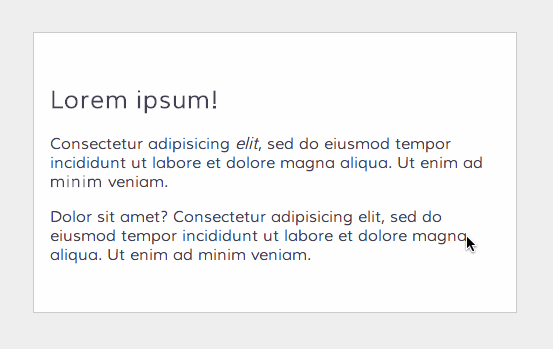

.. Django-Front documentation master file, created by
   sphinx-quickstart on Sat Dec 28 10:24:16 2013.
   You can adapt this file completely to your liking, but it should at least
   contain the root `toctree` directive.

Django-Front
============

Django-front is a front-end editing application for Django

   Using django-front to edit a placholder with three of the supported editors.

Contents:
=========
.. toctree::
   :maxdepth: 2

   introduction.rst
   installation.rst
   setup.rst
   usage.rst
   settings.rst
   changes.rst

